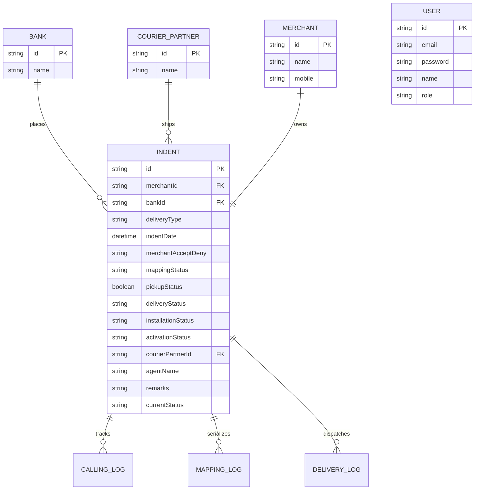

# Product Requirement Document (PRD)
## Sound Box Management & Operational Logistics Dashboard

---

## 1. Executive Summary & Objective
The **Sound Box Management Dashboard** is a high-performance, enterprise-grade logistical tracking and operational intelligence platform. Its primary goal is to provide end-to-end visibility into the lifecycle of Sound Box order processing, deployment, merchant conversion, and technical activation.

By pivoting from a generic database explorer to a structured **hierarchical pivot drill-down engine**, the platform enables operations managers and bank partners to instantly identify bottlenecks, monitor seasonal trends, and export structured datasets for physical dispatch alignment.

---

## 2. Product Objectives & Target Audience
*   **Objectives**:
    *   Synthesize a complex 8-stage operational pipeline into a single, high-fidelity real-time dashboard.
    *   Enable multi-dimensional drill-downs across hierarchical levels: **Bank ➔ Year ➔ Month ➔ Date**.
    *   Maintain pixel-perfect, glassmorphic UI aesthetics with custom indigo-cyan palettes and clean typography.
    *   Provide direct, outline-compliant Excel downloads supporting native sheet-level nesting/grouping.
*   **Target Audience**:
    *   **Operations Leads**: To track logistics pipelines, pickup schedules, courier performance, and RTO (Return to Origin) rates.
    *   **Bank Partners**: To verify bank-specific indent completion, merchant acceptance logs, and installation compliance.

---

## 3. Core Functional Requirements

### 3.1. Interactive KPI Summary Panel
*   **Description**: High-impact cards highlighting critical indicators across the 8 core operational milestones.
*   **Functional Specs**:
    *   **Milestones tracked**:
        1.  **Indent Count**: Total initial requests received.
        2.  **Merchant Accept**: Volume of positive merchant calling confirmation.
        3.  **Merchant Deny**: Denials logged (highlighted in soft high-contrast red).
        4.  **Devices Mapped**: Successful device serialization mapping in backend logs.
        5.  **Pickup Count**: Orders handed over to delivery partners.
        6.  **In Transit**: Active logistics dispatch.
        7.  **Delivery Count**: Orders confirmed delivered at merchant locations.
        8.  **RTO Count**: Delivery failures resulting in returns (highlighted in soft high-contrast red).
    *   **Interactive download**: Hovering or clicking on each KPI card exposes a simple download trigger. Clicking it exports a specific, bank-wise breakdown of that individual metric.

### 3.2. Glassmorphic Sticky Control Panel
*   **Description**: A sticky, blur-filtered control panel containing global dashboard configuration.
*   **Functional Specs**:
    *   **Multi-Select Bank Filter**: Dropdown allowing users to isolate metrics to specific bank institutions (e.g., SBI, HDFC, Canara Bank, Bank of Baroda).
    *   **Multi-Select Year Filter**: Dropdown dynamically populated from DB years.
    *   **Reset Action**: Instantly wipes applied parameters, returning dashboard to the global aggregate state.
    *   **Sticky State**: Remains anchored at the top of the viewport during vertical scrolling, utilizing a transparent backdrop blur (`backdrop-filter: blur(12px)`).

### 3.3. Multi-Level Operational Drilldown (Tree Grid)
*   **Description**: A collapsible tree grid grouping historical data in a parent-child structure.
*   **Functional Specs**:
    *   **Hierarchical Order**: `Bank ➔ Year ➔ Month ➔ Specific Date`.
    *   **Interactive Collapsibility**: Chevron toggles that expand or contract sub-levels without triggering page refreshes.
    *   **Real-time Column Aggregation**: Every level (e.g., a month or a year row) must automatically roll up and sum the exact values of its child nodes across all 8 metrics:
        $$\text{Parent Value} = \sum \text{Child Values}$$
    *   **Visual Indentation & Left Borders**: Left borders colored according to nesting depth (Level 0: Indigo, Level 1: Slate, Level 2: Silver) to ensure excellent structural legibility.
    *   **High-Contrast Dark Header**: Sticky table header with sortable columns for all 8 metrics.

### 3.4. Excel Export with Native Outline Grouping
*   **Description**: Downloader yielding an Excel-compatible file that supports collapsible spreadsheet rows.
*   **Functional Specs**:
    *   **Format**: Generates a standard, MIME-typed Excel XML sheet.
    *   **Nesting Integration**: Leverages Microsoft Office namespace attributes (`mso-outline-level`) to feed the hierarchy levels directly to Excel.
    *   **UX outcome**: When opened in Microsoft Excel or Google Sheets, rows are automatically pre-grouped, allowing operations teams to expand/collapse months and banks directly within the spreadsheet.

### 3.5. Cumulative Indent Progression Chart
*   **Description**: A Cricket Worm-Style progression chart displaying seasonal and chronological performance.
*   **Functional Specs**:
    *   **Visual Style**: Responsive Recharts Line Chart with custom bank-specific curves and soft drop shadow filters.
    *   **Data Aggregation**: Renders cumulative indent growth over time, allowing banks to compare seasonal slope acceleration and run-rate projections.

---

## 4. Technical Architecture & Database Design

### 4.1. Core Tech Stack
*   **Frontend**: React (v19), TypeScript, Redux Toolkit (State Management), Material UI (Component System), Recharts (Analytics Engine).
*   **Backend**: Node.js, Express, TypeScript, Prisma (ORM).
*   **Database**: SQLite (Local development) / PostgreSQL (Production).
*   **Deployment**: Vercel Services (Monorepo architecture with custom path mapping).

### 4.2. Database Schema Model (Prisma Entity-Relationship)

---

## 5. Non-Functional Requirements & Design Aesthetics
*   **Visual Excellence**:
    *   Strictly enforce custom HSL colors (`#4f46e5` Indigo for main accents, `#06b6d4` Cyan for auxiliary operations).
    *   Aesthetics should rely on glassmorphic filtering, clean card shadows, and modern typography (Inter & Outfit fonts).
    *   Zero plain colors (no browser default red/blue/green).
*   **Performance & Reliability**:
    *   **Transactional Integrity**: Complex operations (like simultaneous Merchant creation and Indent registration) must run inside database transactions (`prisma.$transaction`) to avoid orphaned records.
    *   **Query Optimization**: The `/api/dashboard/data` endpoint dynamically calculates aggregates directly on the SQL query where possible to minimize payload sizes over Vercel Serverless bounds.
*   **Production Deployment Model**:
    *   **Vercel JSON mapping**: Configure root service entrypoints:
        *   Frontend: mapped via `framework: vite` to `/`.
        *   Backend: mapped via serverless configuration to `/_/backend`.
